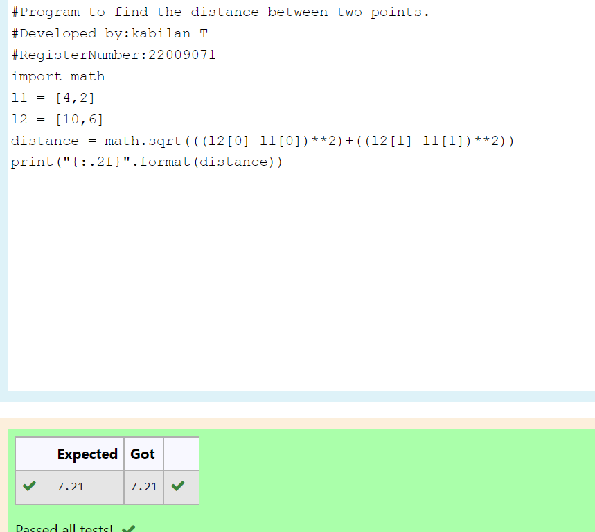

# DISTANCE-BETWEEN-TWO-POINTS

## AIM:

To write a python program to find the distance two 2 points

## ALGORITHM:

### Step 1: 
Import math

### Step 2: 
assign the values of two points

### Step 3: 

Substitute the values in the distance formula  


### Step 4: 
Print the values 

### Step 5: 
End the program

### PROGRAM:
```python
#program to find the distance between two points.
#developed by : Kablian T
#Register Number:22009071
import math
l1=[4,2]
l2=[10,6]
distance= math.sqrt(((l2[0])**2)+((l2[1]-l1[1])**2))
print("{:.2f}".format (distance))
```  


### OUTPUT:


### RESULT:
Thus the distance between two points are successfully found
